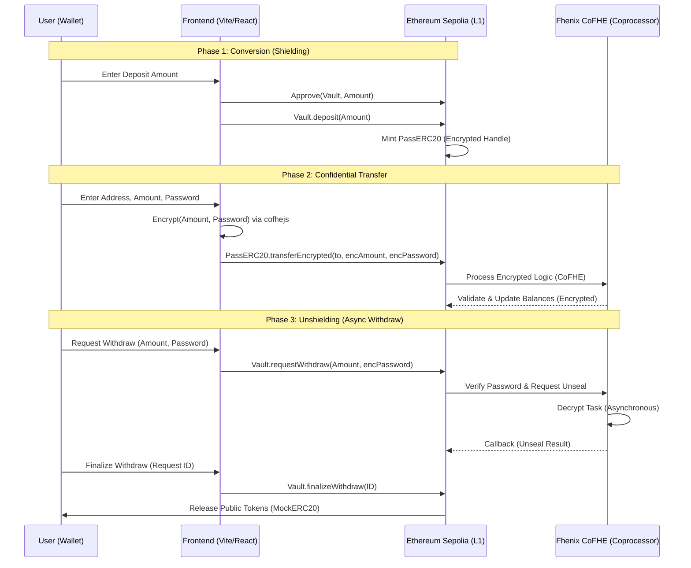

# PASSERC: Password-Protected Confidential Tokens

PASSERC is a high-performance confidential asset layer built on **Ethereum Sepolia** and powered by the **Fhenix CoFHE (Coprocessor)**. It enables users to shield public ERC20 tokens into encrypted assets that are protected by on-chain decentralized passwords.

## 🚀 Key Features

- **Confidential Transfers**: Send tokens without revealing balances or transaction amounts on-chain.
- **On-Chain Password Protection**: Secure your assets with a cryptographic password. Even if your private key is compromised, your protected tokens remain locked.
- **Async Unshielding**: Securely withdraw tokens back to the public layer through an asynchronous CoFHE decryption process.


## 🏗 Architecture & Flow

PASSERC utilizes a **Coprocessor Architecture**. While the asset state lives on Ethereum Sepolia, all complex encrypted computations (FHE) are offloaded to the Fhenix network.



## 🛠 Technical Stack

### Smart Contracts
- **Solidity 0.8.26** (Cancun EVM compatibility)
- **Fhenix CoFHE**: Official `@fhenixprotocol/cofhe-contracts` for encrypted logic.
- **Hardhat**: Deployment and verification pipeline.

### Frontend
- **React + Vite**: Atomic component structure.
- **Tailwind CSS**: Premium glassmorphism and technical UI.
- **Ethers.js**: Blockchain interaction.
- **Cofhejs**: Client-side encryption and permit management.

## 📦 Getting Started

### 1. Installation
```bash
git clone <repository-url>
cd fhenix
npm install
cd frontend && npm install
```

### 2. Configuration
Create a `.env` file in the root directory:
```env
PRIVATE_KEY=your_private_key
ETHERSCAN_API_KEY=your_api_key
```

### 3. Deployment
```bash
npx hardhat run scripts/deploy.ts --network sepolia
```

### 4. Verification
```bash
npx hardhat verify --network sepolia <CONTRACT_ADDRESS>
```

### 5. Running Frontend
```bash
cd frontend
npm run dev
```

## 🔐 Security Disclaimer
This project is currently on **Ethereum Sepolia Testnet**. It is intended for demonstration purposes of the Fhenix CoFHE architecture and should not be used for mainnet assets without a professional security audit.

---
© 2026 PASSERC LABS. DESIGNED FOR THE ERA OF FHE.
